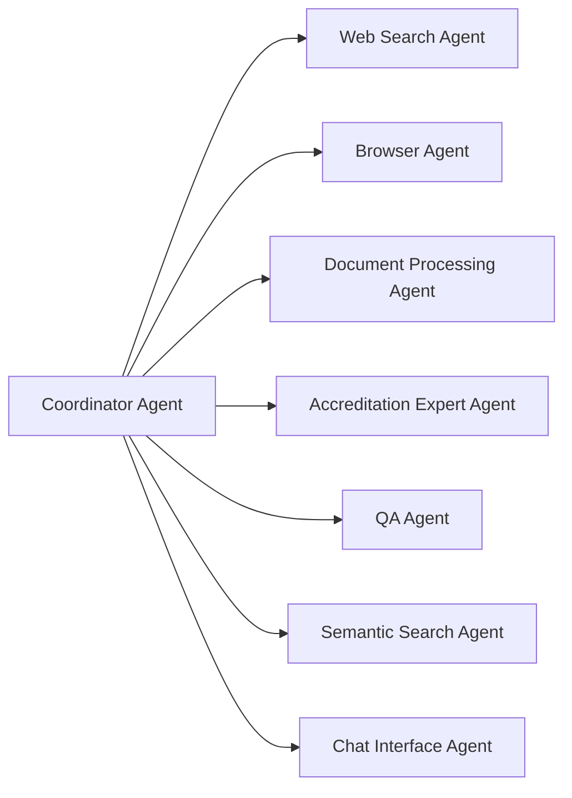

# Multi-Agent Curriculum Alignment System (MACAS) for CEU

A comprehensive serverless platform designed to automatically align curricula across individual university programs at Central European University (CEU). The system enables automated data collection from diverse sources, semantic analysis of curriculum content, gap identification, and generation of unified curriculum documentation with peer university comparisons.

## Overview

MACAS leverages a multi-agent architecture deployed on AWS serverless infrastructure to streamline curriculum analysis and alignment processes. The system combines specialized AI agents for web scraping, document processing, semantic analysis, and quality assurance to provide comprehensive curriculum insights.

## Key Features

### 🤖 Multi-Agent System
- **Coordinator Agent** - Central orchestration of all workflows
- **Web Search Agent** - Discovery of peer university curricula
- **Browser Agent** - Automated extraction from TimeEdit and university websites
- **Document Processing Agent** - Excel/Word/PDF processing and generation
- **Accreditation Expert Agent** - Curriculum analysis and gap identification
- **QA Agent** - Terminology standardization and quality control
- **Semantic Search Agent** - Vector-based curriculum similarity analysis
- **Chat Interface Agent** - Interactive Q&A about analysis results

### 📊 Core Capabilities
- **Automated Data Collection** from TimeEdit portals and peer universities
- **Gap Analysis** between courses and program requirements
- **Peer University Comparison** with benchmarking insights
- **Multi-Format Report Generation** (Excel, Word, PDF)
- **Semantic Curriculum Mapping** with relationship identification
- **Real-time Chat Interface** for curriculum insights
- **Unified Documentation** with standardized terminology

### 🎨 Professional Interface
- **CEU-Branded Design** with institutional colors and typography
- **Responsive Layout** optimized for all device types
- **Real-time Status Monitoring** with agent workflow visibility
- **Configurable LLM Models** with cost optimization
- **Progressive Web App** capabilities for offline access

## Technology Stack

### Backend
- **AWS Lambda** - Serverless function execution
- **API Gateway** - RESTful API management
- **PostgreSQL** (Supabase/Neon) - Structured data storage
- **Qdrant** - Vector database for semantic search
- **S3** - Document storage and static hosting
- **CloudFront** - Global content delivery
- **Step Functions** - Workflow orchestration
- **EventBridge** - Event-driven architecture

### Frontend
- **React 18+** with Vite for fast development
- **Redux Toolkit** for state management
- **Tailwind CSS** for responsive design
- **TypeScript** for type safety
- **PWA** capabilities for enhanced user experience

### AI/ML Integration
- **Multiple LLM Providers** (OpenAI, Anthropic, Grok, Google, Azure)
- **Stagehand/MCP** for web automation
- **Vector Embeddings** for semantic analysis
- **Configurable Model Selection** for cost optimization

## Quick Start

### Prerequisites
- Node.js 18+
- AWS CLI configured
- Git

### One-Command Installation
```bash
# Clone the repository
git clone git@github.com:fwornle/curriculum-alignment.git
cd curriculum-alignment

# Quick setup for development (tanfra account: 930500114053)
./setup-tanfra-dev.sh

# Or full installation (when available)
./install.sh
```

### Development Setup
```bash
# Install dependencies
npm install

# Set up environment variables
cp .env.example .env.development
# Edit .env.development with your configuration

# Start development server
npm run dev
```

## Project Structure

```
curriculum-alignment/
├── docs/                   # Documentation
├── frontend/              # React frontend application
├── lambda/               # AWS Lambda functions (agents)
├── infrastructure/       # AWS SAM/CloudFormation templates
├── database/            # PostgreSQL migrations and schemas
├── tests/               # Test suites (unit, integration, e2e)
├── scripts/             # Deployment and utility scripts
└── .spec-workflow/      # Project specifications
```

## Configuration

### Environment Variables
```bash
# Database
DATABASE_URL=postgresql://...
QDRANT_URL=https://...

# AWS Services
AWS_REGION=us-east-1
S3_BUCKET=curriculum-alignment-documents

# LLM API Keys (stored in AWS Secrets Manager)
OPENAI_API_KEY=sk-...
ANTHROPIC_API_KEY=sk-...
GROK_API_KEY=grok-...
```

### LLM Model Configuration
The system supports configurable LLM models for different agents:
- **Chat Interface**: GPT-4, Claude-3.5-Sonnet, Grok-3
- **Accreditation Expert**: GPT-4, Claude-3.5-Sonnet
- **Semantic Search**: Grok-1 (cost-optimized)
- **QA Agent**: Claude-3-Haiku (efficient)

## Usage

### 1. Data Collection
1. Configure target universities in the admin panel
2. Upload program documents (Excel/Word)
3. Initiate automated TimeEdit extraction
4. Monitor collection progress in real-time

### 2. Analysis
1. Select programs for gap analysis
2. Configure peer university comparisons
3. Start multi-agent analysis workflow
4. Review generated insights and recommendations

### 3. Report Generation
1. Choose analysis results to include
2. Select output format (Excel/Word/PDF)
3. Download professional reports
4. Share with stakeholders

### 4. Interactive Chat
1. Ask questions about curriculum data
2. Get insights about gaps and alignments
3. Explore peer university comparisons
4. Access recommendation explanations

## Architecture

### Multi-Agent Workflow


### Data Flow
1. **Collection**: Browser Agent extracts from TimeEdit → PostgreSQL storage
2. **Processing**: Document Processing Agent handles uploads → Structured data
3. **Analysis**: Accreditation Expert + Semantic Search → Gap identification
4. **Quality**: QA Agent standardizes terminology → Unified documentation
5. **Interaction**: Chat Agent provides insights → User Q&A

## Contributing

### Development Workflow
1. Create feature branch from `main`
2. Implement changes with tests
3. Run quality checks: `npm run test && npm run lint`
4. Submit pull request for review

### Code Standards
- **TypeScript** for all backend and frontend code
- **ESLint + Prettier** for code formatting
- **Jest** for unit testing
- **80%+ test coverage** required
- **Semantic commit messages**

## Deployment

### Development Environment
```bash
# Deploy to development
npm run deploy:dev
```

### Production Environment
```bash
# Deploy to production
npm run deploy:prod
```

### Monitoring
- **CloudWatch** dashboards for system health
- **Real-time agent status** in bottom app bar
- **Cost tracking** and optimization alerts
- **Performance metrics** and error monitoring

## Cost Optimization

### Target Costs
- **AWS Infrastructure**: <$500/month for typical usage
- **LLM API Calls**: <$200/month with optimized model selection
- **Total Operating Cost**: <$700/month for university-scale deployment

### Optimization Strategies
- **Serverless Architecture** for automatic scaling
- **Intelligent Model Selection** based on task complexity
- **Efficient Caching** to reduce redundant operations
- **Connection Pooling** for database optimization

## Security

- **AWS Cognito** authentication
- **Role-based access control**
- **Encryption at rest and in transit**
- **GDPR compliance**
- **Audit logging**
- **OWASP security standards**

## Support

### Documentation
- [User Guide](docs/user-guide/) - Complete usage instructions
- [API Documentation](docs/api/) - REST API reference
- [Administrator Guide](docs/admin-guide/) - System management

### Getting Help
- **Issue Tracker**: Report bugs and feature requests
- **Discussions**: Community support and questions
- **Wiki**: Additional resources and examples

## License

This project is proprietary software developed for Central European University (CEU).

## Acknowledgments

- Central European University for project sponsorship
- AWS for serverless infrastructure platform
- The open-source community for foundational technologies

---

**Version**: 1.0.0  
**Last Updated**: September 2025  
**Maintainer**: CEU IT Services  
**Contact**: curriculum-alignment@ceu.edu# Build trigger Sat Sep 27 17:07:19 CEST 2025
