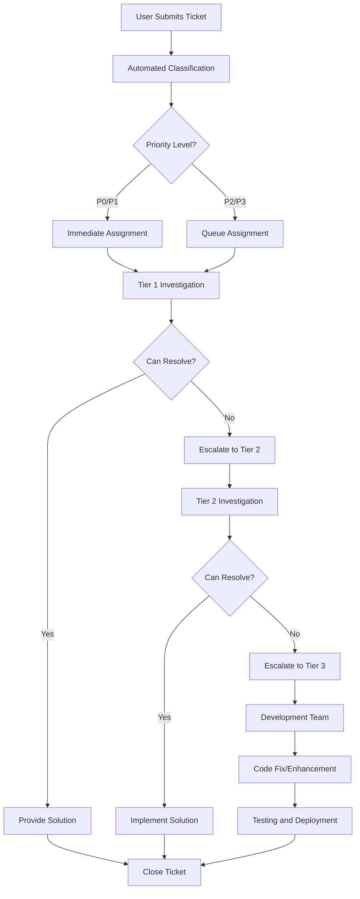

# MACAS Support System

Welcome to the Multi-Agent Curriculum Alignment System (MACAS) support framework. This comprehensive support system ensures users receive timely, effective assistance to maximize their success with curriculum alignment activities.

## Support Overview

### 🎯 Support Philosophy

Our support system is built on the principle of **empowering users** through:

- **Immediate Self-Service:** Comprehensive resources for independent problem-solving
- **Guided Assistance:** Step-by-step support for complex issues
- **Expert Escalation:** Direct access to specialists when needed
- **Continuous Learning:** Integration of support with ongoing skill development
- **Community Support:** Peer-to-peer knowledge sharing and collaboration

### 📊 Support Metrics and Standards

**Response Time Standards:**
- **Critical Issues (P0):** 1 hour response, 4 hour resolution
- **High Priority (P1):** 4 hour response, 24 hour resolution
- **Medium Priority (P2):** 8 hour response, 72 hour resolution
- **Low Priority (P3):** 24 hour response, 1 week resolution

**Service Level Objectives:**
- **Availability:** 99.5% system uptime during business hours
- **Response Quality:** 95% first-contact resolution for Level 1 issues
- **User Satisfaction:** >4.5/5 average satisfaction rating
- **Knowledge Base:** <2 minutes average time to find answers

## Support Channels

### 🆘 Primary Support Channels

**1. Help Center (Self-Service)**
- **URL:** https://help.curriculum-alignment.ceu.edu
- **Available:** 24/7
- **Best For:** Common questions, how-to guides, troubleshooting
- **Features:** Searchable knowledge base, video tutorials, community forums

**2. Live Chat Support**
- **Available:** Monday-Friday, 8:00 AM - 6:00 PM CET
- **Response Time:** <5 minutes during business hours
- **Best For:** Quick questions, technical issues, training support
- **Access:** Via MACAS interface or support portal

**3. Email Support**
- **Address:** support@macas.ceu.edu
- **Available:** 24/7 (monitored during business hours)
- **Response Time:** Within support SLA timeframes
- **Best For:** Complex issues, documentation requests, account management

**4. Phone Support**
- **Number:** +36-1-327-3000 ext. 2500
- **Available:** Monday-Friday, 9:00 AM - 5:00 PM CET
- **Best For:** Urgent issues, system outages, escalated concerns
- **Features:** Callback option available

**5. Emergency Hotline**
- **Number:** +36-1-327-3000 ext. 9999
- **Available:** 24/7
- **Purpose:** Critical system issues, security incidents, data emergencies
- **Authorization:** For designated administrators only

### 📱 Mobile and Remote Support

**Mobile Support App:**
- Download MACAS Support from app stores
- Submit tickets with screenshots and device info
- Receive push notifications for updates
- Access offline troubleshooting guides

**Remote Desktop Support:**
- Available for complex technical issues
- Secure, encrypted connections
- User permission required
- Session recording for training purposes

## Support Tiers and Escalation

### 🎚️ Three-Tier Support Structure

**Tier 1: General Support (Front Line)**
- **Scope:** Common questions, basic troubleshooting, account issues
- **Staff:** Certified MACAS support specialists
- **Resolution Rate:** 80% of all tickets
- **Escalation Trigger:** Technical complexity beyond basic configuration

**Tier 2: Technical Support (Specialists)**
- **Scope:** Advanced configuration, integration issues, performance problems
- **Staff:** Senior technical analysts with development background
- **Resolution Rate:** 95% of escalated tickets
- **Escalation Trigger:** System-level issues, custom development needs

**Tier 3: Engineering Support (Developers)**
- **Scope:** Bug fixes, feature requests, architectural issues
- **Staff:** Core development team and system architects
- **Resolution Rate:** 100% through code changes or workarounds
- **Involvement:** Product roadmap decisions, major incidents

### ⚡ Escalation Triggers

**Automatic Escalation:**
- No response from Tier 1 within SLA
- Customer explicitly requests escalation
- Issue tagged as "urgent" by system
- Multiple related tickets from same organization

**Manual Escalation Criteria:**
- Requires code changes or system configuration
- Affects multiple users or institutions
- Security or compliance implications
- Customer satisfaction score <3/5

## Issue Classification and Prioritization

### 🚨 Priority Levels

**P0 - Critical**
- **Definition:** System completely unavailable or major security breach
- **Examples:** 
  - Complete system outage
  - Data corruption or loss
  - Security vulnerability exploitation
  - Authentication system failure
- **Response:** Immediate all-hands response
- **Communication:** Real-time status updates

**P1 - High**
- **Definition:** Major functionality impaired, significant user impact
- **Examples:**
  - Analysis engine not processing requests
  - Document upload failures affecting multiple users
  - Integration with key external systems broken
  - Performance degradation >50%
- **Response:** Senior staff assigned within 1 hour
- **Communication:** Hourly status updates

**P2 - Medium**
- **Definition:** Partial functionality affected, workarounds available
- **Examples:**
  - Report generation delays
  - Minor UI issues affecting usability
  - Non-critical feature failures
  - Single user account issues
- **Response:** Standard support process
- **Communication:** Daily status updates

**P3 - Low**
- **Definition:** Minor issues, cosmetic problems, feature requests
- **Examples:**
  - Spelling errors in interface
  - Enhancement requests
  - Documentation updates
  - Training requests
- **Response:** Handled in regular queue
- **Communication:** Weekly status updates

### 🏷️ Issue Categories

**Technical Issues:**
- System errors and bugs
- Performance and reliability problems
- Integration and API issues
- Security and access problems

**User Experience:**
- Interface and usability concerns
- Training and education needs
- Documentation and help requests
- Feature requests and suggestions

**Administrative:**
- Account management and access
- Billing and licensing questions
- Policy and compliance queries
- Data management and export requests

## Self-Service Resources

### 📚 Knowledge Base Structure

**Getting Started Section:**
- System overview and onboarding
- Initial setup and configuration
- Basic navigation and features
- Common first-time user issues

**How-To Guides:**
- Step-by-step task instructions
- Best practices and tips
- Advanced feature utilization
- Integration setup guides

**Troubleshooting Center:**
- Error message explanations
- Common problem solutions
- Performance optimization tips
- Browser and system requirements

**Video Library:**
- Feature demonstrations
- Training session recordings
- Expert tips and tricks
- New feature announcements

### 🔍 Search and Navigation

**Smart Search Features:**
- Natural language query processing
- Auto-complete and suggestions
- Search result ranking by relevance
- Filter by category, difficulty, and date

**Knowledge Organization:**
- Hierarchical category structure
- Tag-based content classification
- Related article suggestions
- User rating and feedback system

## Community Support

### 👥 User Community Forums

**Forum Categories:**
- **General Discussion:** General MACAS topics and news
- **Technical Q&A:** User-to-user technical help
- **Best Practices:** Share successful implementation strategies
- **Feature Requests:** Community voting on new features
- **Training Exchange:** Share training materials and tips

**Community Guidelines:**
- Respectful and professional communication
- Search before posting new topics
- Provide clear problem descriptions
- Share solutions that work for you
- Help others when you can

**Moderation:**
- MACAS staff moderators monitor daily
- Community guidelines enforcement
- Expert verification of technical answers
- Regular community events and challenges

### 🏆 Recognition and Incentives

**Community Contributor Program:**
- Points for helpful answers and contributions
- Badges for expertise levels and achievements
- Monthly recognition of top contributors
- Exclusive access to beta features and events

**Expert Network:**
- Certified users identified as community experts
- Direct line to product development team
- Opportunity to beta test new features
- Invitation to user advisory board

## Support Documentation and Procedures

### 📋 Internal Support Procedures

**Ticket Management Workflow:**



**Quality Assurance Process:**
1. **Ticket Review:** All resolved tickets reviewed by senior staff
2. **Solution Validation:** Technical solutions tested before closure
3. **Customer Feedback:** Post-resolution satisfaction surveys
4. **Knowledge Capture:** Solutions added to knowledge base
5. **Process Improvement:** Regular analysis of support metrics

### 📊 Support Metrics and Reporting

**Key Performance Indicators:**
- First Contact Resolution Rate
- Average Response Time by Priority
- Customer Satisfaction Scores
- Ticket Volume Trends
- Knowledge Base Usage Analytics

**Reporting Schedule:**
- **Daily:** Critical issue status updates
- **Weekly:** Team performance metrics
- **Monthly:** Comprehensive support analytics
- **Quarterly:** Service level review and improvement planning

**Dashboard Metrics:**
```javascript
// Support Dashboard KPIs
const supportMetrics = {
  responseTime: {
    p0: { target: '1 hour', current: '45 minutes', trend: 'improving' },
    p1: { target: '4 hours', current: '3.2 hours', trend: 'stable' },
    p2: { target: '8 hours', current: '6.8 hours', trend: 'improving' },
    p3: { target: '24 hours', current: '18 hours', trend: 'stable' }
  },
  resolutionRate: {
    tier1: { target: '80%', current: '85%', trend: 'improving' },
    tier2: { target: '95%', current: '93%', trend: 'stable' },
    overall: { target: '98%', current: '97%', trend: 'stable' }
  },
  satisfaction: {
    average: { target: '4.5/5', current: '4.6/5', trend: 'stable' },
    promoterScore: { target: '70', current: '73', trend: 'improving' }
  },
  availability: {
    system: { target: '99.5%', current: '99.7%', trend: 'stable' },
    support: { target: '95%', current: '97%', trend: 'improving' }
  }
};
```

## Training and Development

### 🎓 Support Staff Training Program

**Initial Training (40 hours):**
- MACAS system mastery
- Customer service excellence
- Technical troubleshooting methods
- Communication skills development
- Support tools and processes

**Ongoing Development:**
- Monthly skill-building workshops
- Quarterly system update training
- Annual customer service certification
- Cross-training in specialized areas

**Certification Requirements:**
- Complete initial training program
- Pass comprehensive system knowledge exam
- Demonstrate customer interaction skills
- Maintain continuing education credits

### 📈 Career Development Paths

**Support Specialist → Senior Specialist → Team Lead**
- Progressive responsibility and complexity
- Mentoring and training opportunities
- Specialization in technical areas
- Leadership development program

**Cross-Functional Opportunities:**
- Product development collaboration
- User experience research participation
- Training program development
- Sales and implementation support

## Continuous Improvement

### 🔄 Feedback and Enhancement Process

**Customer Feedback Collection:**
- Post-resolution surveys (automated)
- Quarterly satisfaction surveys
- Annual support experience review
- Focus groups and user interviews

**Internal Process Review:**
- Monthly team retrospectives
- Quarterly process optimization sessions
- Annual support strategy review
- Continuous benchmarking against industry standards

**Improvement Implementation:**
- Rapid testing of process changes
- A/B testing of support approaches
- Regular tool and technology updates
- Staff suggestion and innovation program

### 📋 Support System Evolution

**Technology Roadmap:**
- AI-powered ticket routing and response suggestions
- Enhanced self-service capabilities
- Predictive issue identification
- Advanced analytics and reporting

**Service Expansion:**
- Extended support hours for global users
- Multilingual support capabilities
- Specialized industry vertical support
- Proactive system monitoring and alerts

---

## Getting Support

### 🚀 Quick Start Guide for New Users

**Before Contacting Support:**
1. Check the [Knowledge Base](https://help.curriculum-alignment.ceu.edu)
2. Search [Community Forums](https://community.macas.ceu.edu)
3. Review relevant [Training Materials](../training/index.md)
4. Try the suggested troubleshooting steps

**When You Need to Contact Us:**
1. **Choose the right channel** based on urgency and complexity
2. **Provide detailed information** about your issue
3. **Include screenshots** and error messages when relevant
4. **Specify your role** and institution for faster service

**Information to Include in Support Requests:**
- Your name, email, and institution
- MACAS username and role
- Browser and operating system
- Steps that led to the issue
- What you expected vs. what happened
- Any error messages or codes
- Screenshots or screen recordings

### 📞 Emergency Contact Information

**System Emergencies:**
- **Phone:** +36-1-327-3000 ext. 9999
- **Email:** emergency@macas.ceu.edu
- **Available:** 24/7 for critical system issues

**Business Hours Support:**
- **Phone:** +36-1-327-3000 ext. 2500
- **Email:** support@macas.ceu.edu
- **Chat:** Available in MACAS interface
- **Hours:** Monday-Friday, 8:00 AM - 6:00 PM CET

---

*The MACAS Support System is designed to ensure your success with curriculum alignment initiatives. We're here to help you achieve your educational goals through effective technology utilization and ongoing support.*

---

**Support Team Leadership:**

**Director of User Support**  
Sarah Chen  
sarah.chen@ceu.edu  
+36-1-327-3000 ext. 2501

**Senior Technical Support Manager**  
Michael Rodriguez  
michael.rodriguez@ceu.edu  
+36-1-327-3000 ext. 2502

**Community Manager**  
Emma Thompson  
emma.thompson@ceu.edu  
+36-1-327-3000 ext. 2503

*Last updated: March 2024*