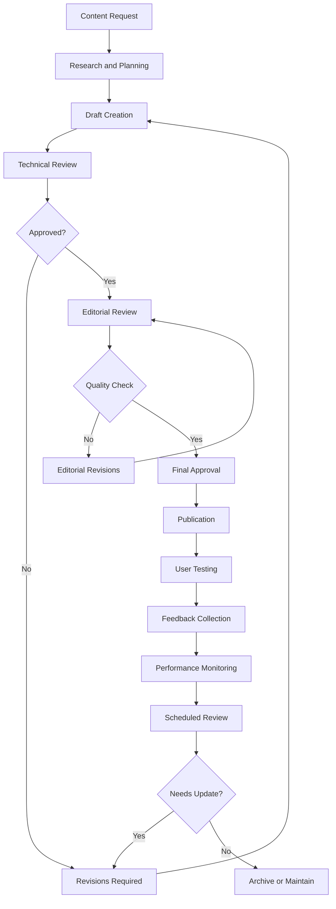

# Knowledge Base Management

This document outlines the structure, maintenance, and content strategy for the MACAS Knowledge Base - a comprehensive self-service resource for users to find answers and solve problems independently.

## Knowledge Base Structure

### 🏗️ Content Organization

**Primary Categories:**

**1. Getting Started**
```
├── System Overview
├── Account Setup and Login
├── First Steps Tutorial
├── Interface Navigation
├── Basic Concepts and Terminology
└── Quick Start Checklist
```

**2. Core Features**
```
├── Document Management
│   ├── Upload Guidelines
│   ├── File Formats and Requirements
│   ├── Organization and Tagging
│   └── Version Control
├── Analysis Tools
│   ├── Analysis Types Overview
│   ├── Configuration Guidelines
│   ├── Parameter Explanations
│   └── Results Interpretation
├── Report Generation
│   ├── Report Types and Templates
│   ├── Customization Options
│   ├── Export and Sharing
│   └── Scheduling and Automation
└── Collaboration Features
    ├── Team Workspaces
    ├── Sharing and Permissions
    ├── Comments and Annotations
    └── Review Workflows
```

**3. Advanced Features**
```
├── Custom Frameworks
├── Batch Processing
├── API Integration
├── Advanced Analytics
├── System Administration
└── Enterprise Features
```

**4. Troubleshooting**
```
├── Common Issues and Solutions
├── Error Messages and Codes
├── Performance Optimization
├── Browser Compatibility
├── Network and Connectivity
└── Integration Problems
```

**5. Best Practices**
```
├── Curriculum Alignment Strategies
├── Document Preparation Guidelines
├── Analysis Optimization
├── Report Design Principles
├── Collaboration Workflows
└── Quality Assurance Methods
```

**6. Reference Materials**
```
├── Feature Specifications
├── System Requirements
├── Keyboard Shortcuts
├── Glossary of Terms
├── External Resources
└── Related Standards and Frameworks
```

### 📊 Content Metadata Structure

```json
{
  "article_metadata": {
    "id": "unique_article_identifier",
    "title": "Clear, searchable article title",
    "category": "Primary category",
    "subcategory": "Secondary classification",
    "tags": ["keyword1", "keyword2", "feature_name"],
    "difficulty_level": "beginner|intermediate|advanced",
    "estimated_read_time": "5 minutes",
    "last_updated": "2024-03-15",
    "author": "Content creator name",
    "reviewer": "Technical reviewer name",
    "version": "1.2",
    "related_articles": ["id1", "id2", "id3"],
    "user_rating": 4.6,
    "view_count": 1247,
    "helpful_votes": 89,
    "languages": ["en", "hu"],
    "applies_to_version": "2.1+",
    "prerequisites": ["basic_navigation", "document_upload"]
  }
}
```

## Content Creation Standards

### ✍️ Writing Guidelines

**Article Structure Template:**

```markdown
# Article Title (Clear, Action-Oriented)

**Estimated Reading Time:** X minutes  
**Difficulty Level:** Beginner/Intermediate/Advanced  
**Last Updated:** Date  

## Overview
Brief description of what this article covers and who should read it.

## Prerequisites
- List any required knowledge or completed steps
- Link to prerequisite articles
- Note any system requirements

## Step-by-Step Instructions

### Step 1: Clear Action Title
1. Specific, numbered instructions
2. Include screenshots where helpful
3. Note any variations or alternatives
4. Highlight important warnings or tips

### Step 2: Next Action
Continue with detailed steps...

## Common Issues and Solutions
Address frequent problems users encounter during this process.

## Related Articles
- [Link to related topic 1](../related-article-1.md)
- [Link to related topic 2](../related-article-2.md)

## Feedback and Improvements
Was this article helpful? [Rate this article] [Suggest improvements]

---
*Article ID: KB001234 | Version: 1.2 | Last Updated: March 15, 2024*
```

**Content Quality Standards:**

**Clarity and Accessibility:**
- Write in clear, plain language
- Define technical terms on first use
- Use active voice and direct instructions
- Include visual aids where helpful
- Provide examples and use cases

**Accuracy and Currency:**
- Verify all information against current system
- Test all procedures before publication
- Update screenshots to match current interface
- Review after each system release
- Flag outdated content for revision

**Completeness and Usefulness:**
- Cover the complete workflow, not just partial steps
- Include troubleshooting for common issues
- Provide alternative methods when applicable
- Address different user roles and permissions
- Include relevant warnings and limitations

### 📸 Visual Content Standards

**Screenshots and Images:**
```
Guidelines for Visual Content:

Resolution and Quality:
- Minimum 1200px width for detailed interface screenshots
- High contrast and clear visibility
- Consistent browser chrome (prefer clean, minimal)
- Callouts and annotations where helpful

Consistency:
- Use same browser for all screenshots (Chrome preferred)
- Consistent zoom level (100% recommended)
- Standard window size for reproducibility
- Uniform annotation style and colors

Privacy and Security:
- Remove or blur personal information
- Use generic example data
- Avoid real institutional names in examples
- No sensitive system information visible

File Management:
- PNG format for screenshots
- SVG for diagrams and illustrations  
- Descriptive filenames (feature-action-step1.png)
- Organized in logical folder structure
- Optimized file sizes for web performance
```

**Video Content:**
```
Video Production Standards:

Technical Requirements:
- 1080p minimum resolution
- Clear audio narration
- Consistent pacing (not too fast/slow)
- Professional screen recording software

Content Structure:
- Brief introduction (what will be covered)
- Step-by-step demonstration
- Key points highlighted or repeated
- Summary of what was accomplished
- Next steps or related topics

Accessibility:
- Closed captions for all videos
- Audio descriptions where needed
- Transcript available for download
- Clear, pauseable pacing
```

## Content Lifecycle Management

### 🔄 Creation and Review Process

**Content Development Workflow:**



**Review Schedule:**
- **New Articles:** Technical and editorial review before publication
- **Monthly:** High-traffic articles (>1000 views)
- **Quarterly:** Medium-traffic articles (100-1000 views)
- **Semi-annually:** Low-traffic articles (<100 views)
- **After System Updates:** All affected articles within 2 weeks
- **User-Reported Issues:** Within 48 hours of report

### 📈 Performance Tracking

**Article Analytics:**
```javascript
// Knowledge Base Analytics Tracking
const articleMetrics = {
  engagement: {
    page_views: 1247,
    unique_visitors: 892,
    time_on_page: '3:42',
    bounce_rate: 0.23,
    completion_rate: 0.78
  },
  user_feedback: {
    helpful_votes: 89,
    not_helpful_votes: 12,
    average_rating: 4.6,
    comments_count: 15,
    improvement_suggestions: 3
  },
  search_performance: {
    search_impressions: 2341,
    click_through_rate: 0.53,
    average_search_position: 2.1,
    keywords: ['document upload', 'file formats', 'troubleshooting']
  },
  conversion_tracking: {
    problem_solved: 78, // Users who didn't contact support after
    support_ticket_reduction: 0.23, // 23% fewer tickets on this topic
    training_completions: 45 // Users who completed related training
  }
};
```

**Content Performance Indicators:**
- **High-Performing Content:** >4.0 rating, <30% bounce rate, >70% completion
- **Needs Improvement:** <3.5 rating, >50% bounce rate, frequent "not helpful" votes
- **Update Priority:** High traffic + declining performance metrics
- **Retirement Candidates:** <10 views/month, obsolete features, redundant content

### 🔍 Search and Discoverability

**Search Optimization:**
```
SEO Best Practices for Knowledge Base:

Title Optimization:
✓ Include primary keyword in title
✓ Use action-oriented language
✓ Keep under 60 characters when possible
✓ Match user search intent

Content Structure:
✓ Use descriptive headings (H2, H3)
✓ Include relevant keywords naturally
✓ Provide comprehensive coverage of topic
✓ Use bullet points and lists for scannability

Internal Linking:
✓ Link to related articles contextually
✓ Create topic cluster architecture  
✓ Use descriptive anchor text
✓ Maintain reasonable link density

Technical SEO:
✓ Fast page loading times
✓ Mobile-responsive design
✓ Clean URL structure
✓ Proper meta descriptions
```

**Search Feature Implementation:**
- **Auto-complete:** Suggest queries as user types
- **Faceted Search:** Filter by category, difficulty, content type
- **Smart Results:** ML-powered relevance ranking
- **Search Analytics:** Track query patterns and gaps
- **Visual Search:** Search by screenshot or UI element

## User-Generated Content

### 👥 Community Contributions

**Community Article Program:**
```
Contribution Guidelines:

Eligibility:
- Certified MACAS users
- Subject matter expertise demonstrated
- Previous helpful community participation
- Agreement to content licensing terms

Submission Process:
1. Propose article topic via community portal
2. Receive approval and content guidelines
3. Submit draft through designated system
4. Undergo peer and editorial review
5. Collaborate on revisions if needed
6. Receive credit and recognition for published work

Recognition Program:
- Byline credit on published articles
- Community contributor badge
- Points toward expert certification
- Annual contributor recognition event
- Networking opportunities with product team
```

**User Feedback Integration:**
- **Article Rating System:** 5-star rating with written feedback option
- **Improvement Suggestions:** Structured form for content enhancement ideas
- **Missing Content Reports:** Easy way to request new articles
- **Error Reporting:** Quick issue flagging for inaccuracies
- **Success Stories:** User submissions showing how articles helped

### 📝 Comment and Discussion Features

**Moderated Comments:**
```
Comment Policy:

Allowed:
✓ Clarifying questions about article content
✓ Additional tips and insights
✓ Alternative approaches or solutions
✓ Constructive suggestions for improvement
✓ Relevant experience sharing

Not Allowed:
✗ Off-topic discussions
✗ Marketing or promotional content
✗ Personal information sharing
✗ Criticism without constructive feedback
✗ Duplicate or redundant comments

Moderation Process:
- All comments reviewed before publication
- Response within 24 hours during business days
- Clear explanation for rejected comments
- Appeal process for contested decisions
```

## Multilingual and Accessibility

### 🌍 Localization Strategy

**Language Support:**
```
Primary Language: English
- Complete coverage of all content
- Latest updates and new features first
- Primary maintenance and optimization

Secondary Language: Hungarian  
- Core articles translated
- Focus on high-traffic content
- Quarterly translation updates
- Local cultural adaptations

Future Languages (Based on User Base):
- German (planned for 2024)
- French (under consideration)
- Spanish (under consideration)
```

**Translation Workflow:**
1. **Content Freeze:** Lock English source content
2. **Professional Translation:** Certified translators with technical expertise
3. **Review Process:** Native speakers with MACAS knowledge verify accuracy
4. **Technical Testing:** Verify all links, images, and functionality
5. **Publication:** Release with clear version tracking
6. **Maintenance:** Regular updates aligned with English versions

### ♿ Accessibility Standards

**WCAG 2.1 AA Compliance:**
```
Content Accessibility Requirements:

Text and Reading:
✓ Minimum 4.5:1 color contrast ratio
✓ Resizable text up to 200% without scrolling
✓ Clear, simple language (8th grade reading level target)
✓ Logical heading structure (H1, H2, H3 hierarchy)

Navigation and Structure:
✓ Keyboard navigation support
✓ Skip links for main content
✓ Consistent navigation patterns
✓ Breadcrumb navigation

Media and Images:
✓ Alt text for all informative images
✓ Captions and transcripts for videos
✓ Audio descriptions for visual-heavy content
✓ No auto-playing media

Interactive Elements:
✓ Clear focus indicators
✓ Sufficient target size (44px minimum)
✓ Error identification and suggestions
✓ Form labels and instructions
```

## Integration with Support System

### 🔗 Support Ticket Integration

**Knowledge Base First Approach:**
```
Smart Suggestion System:

When User Submits Ticket:
1. Analyze ticket content for keywords
2. Search knowledge base for relevant articles
3. Present top 3-5 suggested articles
4. Allow user to indicate if suggestions helped
5. Route to human support only if articles don't resolve issue

Success Tracking:
- Measure deflection rate (tickets avoided)
- Track user satisfaction with suggested content
- Identify gaps where articles don't exist
- Monitor improvement in resolution rates
```

**Content-Driven Support:**
- **Proactive Suggestions:** Show relevant articles based on user's current page/action
- **Contextual Help:** In-app tooltips and help links to specific knowledge base sections
- **Learning Pathways:** Guided sequences of articles for complex workflows
- **Update Notifications:** Alert users to new articles on topics they've viewed

### 📊 Analytics and Optimization

**Data-Driven Content Strategy:**
```python
# Knowledge Base Analytics Dashboard
class KnowledgeBaseAnalytics:
    def generate_content_insights(self):
        return {
            'top_performing_articles': self.get_highest_rated(),
            'content_gaps': self.identify_missing_content(),
            'update_priorities': self.calculate_update_urgency(),
            'user_journey_analysis': self.map_content_paths(),
            'search_optimization_opportunities': self.analyze_failed_searches(),
            'support_ticket_correlation': self.correlate_with_support_data()
        }
    
    def identify_missing_content(self):
        # Analyze support tickets for topics not covered in KB
        support_topics = self.get_support_ticket_topics()
        kb_topics = self.get_knowledge_base_topics()
        gaps = support_topics - kb_topics
        
        return sorted(gaps, key=lambda x: x.frequency, reverse=True)
    
    def calculate_update_urgency(self):
        # Prioritize content updates based on multiple factors
        articles = self.get_all_articles()
        
        for article in articles:
            urgency_score = (
                article.traffic_weight * 0.3 +
                article.staleness_score * 0.25 +
                article.user_feedback_score * 0.25 +
                article.system_change_impact * 0.2
            )
            article.update_priority = urgency_score
        
        return sorted(articles, key=lambda x: x.update_priority, reverse=True)
```

---

## Knowledge Base Maintenance Team

### 👥 Roles and Responsibilities

**Content Manager (Sarah Wilson)**
- Overall content strategy and planning
- Editorial standards and quality assurance
- Performance monitoring and optimization
- Team coordination and resource allocation

**Technical Writer (Mark Chen)**
- Article creation and maintenance
- Technical accuracy verification
- Visual content coordination
- User testing facilitation

**Community Moderator (Lisa Rodriguez)**
- User feedback management
- Community contribution coordination
- Discussion moderation
- User recognition programs

**UX/Search Specialist (David Kim)**
- Search optimization and analytics
- Information architecture
- Accessibility compliance
- User experience improvements

### 📅 Content Calendar and Planning

**Monthly Planning Process:**
1. **Analytics Review:** Analyze previous month's performance
2. **Gap Analysis:** Identify missing or outdated content
3. **Priority Setting:** Rank content needs by impact and effort
4. **Resource Allocation:** Assign writers and reviewers
5. **Timeline Creation:** Set realistic delivery schedules
6. **Quality Gates:** Plan review and approval checkpoints

**Content Types and Frequency:**
- **New Feature Articles:** Within 2 weeks of feature release
- **Seasonal Updates:** Quarterly review and refresh cycles
- **User-Requested Content:** Monthly batch processing
- **Troubleshooting Updates:** As issues are identified and resolved
- **Best Practice Guides:** Quarterly development based on user success patterns

---

*The Knowledge Base serves as the foundation of our self-service support strategy. By maintaining high-quality, current, and accessible content, we empower users to solve problems independently while reducing support burden and improving overall user satisfaction.*

**Document Version:** 1.1  
**Last Updated:** March 15, 2024  
**Next Review:** June 15, 2024  
**Owner:** Sarah Wilson, Content Manager